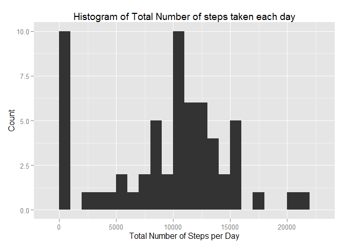
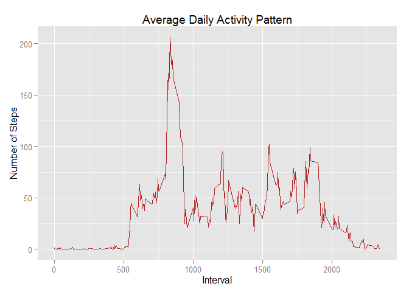
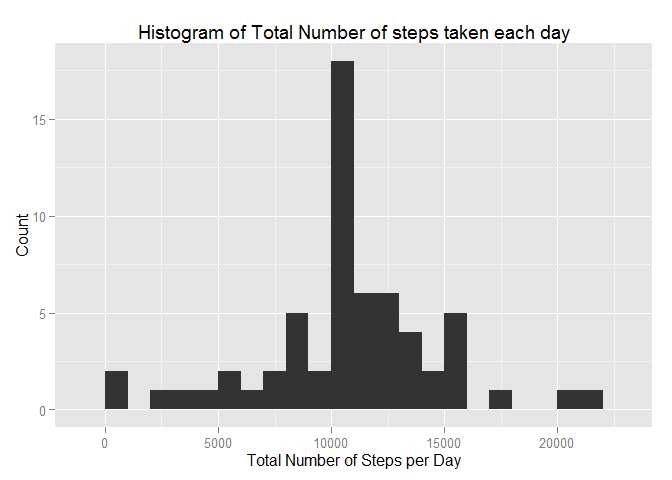
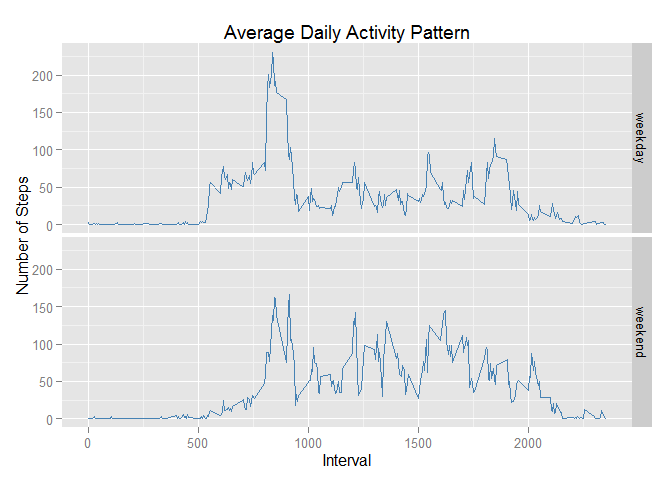

# Reproducible Research: Peer Assessment 1


```r
library(knitr)
opts_chunk$set(echo=TRUE, message=FALSE, warnings=FALSE, results="asis")
```

## Loading and preprocessing the data

*    Read activity.csv file into a dataframe DF 
    

```r
DF <- read.csv("activity.csv", header=TRUE)
```

*    Convert the dataframe DF to dplyr table format DT. 
    

```r
library(dplyr)
DT <- tbl_df(DF)
```

## What is the mean total number of steps taken per day?

*    Calculate the total of 'steps', group by 'date' in table DT. Missing values are ignored.
    

```r
byDt <- summarise(group_by(DT,date), total=sum(steps,na.rm=TRUE))
```

*    Histogram of the total number of steps taken each day


```r
library(ggplot2)
ggplot(byDt,aes(x=total)) + geom_histogram(binwidth=1000)  +
    ggtitle("Histogram of Total Number of steps taken each day") +
    labs(x="Total Number of Steps per Day", y="Count")
```

 

```r
Mean <- mean(byDt$total)
Median <- median(byDt$total)
```

    The mean of the total number of steps taken per day :9354.2295082 
    The median of the total number of steps taken per day : 10395 

## What is the average daily activity pattern?

* Time series plot of the 5-minute interval (x-axis) and the average number of steps taken, averaged across all days (y-axis). Missing values are ignored.
    

```r
byInt <- summarise(group_by(DT,interval), avg=mean(steps,na.rm=TRUE))
ggplot(data=byInt, aes(interval,avg)) + 
    geom_line(color="firebrick") +
    ggtitle("Average Daily Activity Pattern") +
    labs(x="Interval", y="Number of Steps")
```

 

```r
max <- filter(byInt, avg==max(avg))[1,1]
```

* The 5-minute interval 835 has the maximum number of steps on average across all days.  

##Imputing missing values

*    Calculate and report the total number of missing values in the dataset 

```r
cnt_na <- summarise(filter(DT, is.na(steps)), n=n())
```
    
    Total number of missing values is 2304

* Histogram of total number of steps taken per day after imputing missing values

    The strategy adopted for filling in all of the missing values in the dataset is to use the mean for that 5-minute interval. 


```r
DT1 <- merge(DT, byInt)
for (id in 1:nrow(DT1)) {
	if(is.na(DT1$steps[id])) {
	    DT1$steps[id] <- DT1$avg[id]
	}
}
DT1 <- select(DT1, -avg)
byDt1 <- summarise(group_by(DT1,date), total=sum(steps))
ggplot(byDt1,aes(x=total)) + geom_histogram(binwidth=1000) +
    ggtitle("Histogram of Total Number of steps taken each day") +
    labs(x="Total Number of Steps per Day", y="Count")
```

 

```r
Mean1 <- mean(byDt1$total)
Median1 <- median(byDt1$total)
```

    The mean of the total number of steps taken per day :10766 
    The median of the total number of steps taken per day : 10766  
    The differences of the above values with the values computed without imputing missing data: 
        diffence in mean: 1411.959171 
        difference in Median: 371.1886792              
                 
    So after imputing missing data, both mean and median increased. But observed increase in median is much less compared to that in the mean. Also the mean has became equal to the median.

##Are there differences in activity patterns between weekdays and weekends?

* Time series plot of the 5-minute interval (x-axis) and the average number of steps taken, averaged across all days (y-axis). Missing values are imputed.


```r
DT1$date <- as.Date(DT1$date)
DT1 <- mutate(DT1, wkday=ifelse(weekdays(DT1$date, abbreviate=TRUE) %in% 
		c("Sun","Sat"),"weekend","weekday"))
byInt1 <- summarise(group_by(DT1,wkday, interval), avg=mean(steps))
		
ggplot(data=byInt1, aes(interval,avg)) + 
    geom_line(color="steelblue") + facet_grid(wkday ~ .) +
    ggtitle("Average Daily Activity Pattern") +
    labs(x="Interval", y="Number of Steps")
```

 

    The plot shows that there is a slight increase in the activity pattern over the weekend compared to that over weekdays.
